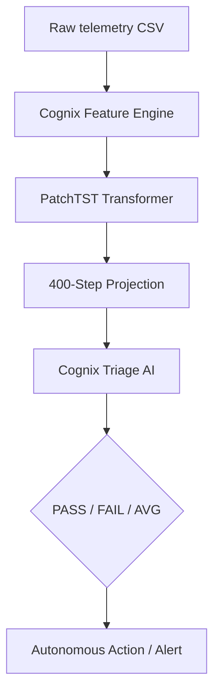

# cognix
Autonomous Triage AI: Classifies failure modes (Thermal, IOPS, QD) with natural language remediation advice. Production Dashboard: A premium, NiceGUI-based interface for real-time fleet monitoring and model status.

# 🚀 Cognix: AI-Powered Time-Series Forecasting

[](https://github.com/your-repo/cognix)
[](https://www.python.org/)
[]()

**Cognix** is a high-performance deep learning system designed to predict future SSD/NVMe workload behavior from historical performance telemetry. By leveraging the **PatchTST (Patch-based Time Series Transformer)** architecture, Cognix identifies thermal throttling risks, IOPS degradation, and steady-state convergence failures **before they occur**.

---

## 🎯 Key Capabilities

*   **Multivariate Forecasting**: Simultaneously predicts 9 performance dimensions including IOPS, Latency, and Temperature.
*   **Massive Horizon**: Projects **400 future workloads** from just 100 historical observations.
*   **Domain Intelligence**: Native support for **SNIA PTS** performance logs and metadata.
*   **Autonomous Triage**: Integrated AI validator that classifies failure modes (Thermal, IOPS Drop, QD Sensitivity) and provides remediation suggestions.
*   **Inference Acceleration**: PyTorch models optimized for **ONNX Runtime**, enabling 2-5x faster inference.

---

## 🏗️ Architecture



---

## 🚀 Quick Start

### 1. Installation
```bash
git clone https://github.com/your-repo/cognix.git
cd cognix
python -m venv venv
source venv/bin/activate
pip install -r requirements.txt
```

### 2. Launch the Dashboard
```bash
python ui_nicegui/app.py
```
Visit `http://localhost:8080` to interact with the premium SaaS dashboard.

---

## 📊 Dashboard Features

*   **Deep Forecast**: High-resolution latency and thermal curves.
*   **Aggregate Metrics**: Fleet-wide performance statistics and QD scaling analysis.
*   **Model Health**: Real-time status of PyTorch and ONNX inference engines.
*   **Autonomous Logs**: Live feed of the predictive engine's activity.

---

## 🛠️ Integration

Cognix is designed to be integrated as a "Skill" for autonomous agents:

```python
from cognix.agent.forecast_validator import ForecastAgentValidator

# Initialize the validator with custom SLAs
validator = ForecastAgentValidator(latency_sla_us=8000)

# Evaluate a predicted block of workloads
result = validator.evaluate_forecast(predicted_data, baseline_iops=120000)

print(f"Status: {result['performance_ok']}")
print(f"Triage: {result['triage_suggestion']}")
```

---

© 2026 Cognix AI Team. Part of the Cognix Autonomous Ecosystem.

